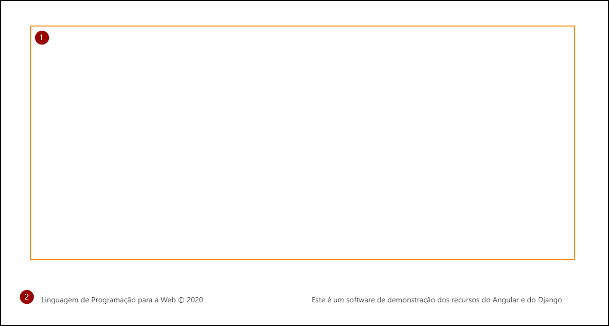
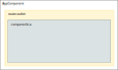

# App

O componente `AppComponent` funciona como um `shell component` para o módulo `AppModule`, o que significa que o template dele utiliza a diretiva `router-outlet` para indicar onde outros componentes devem ser apresentados. A figura a seguir ilustra a estrutura visual do componente.

A figura mostra que a região (1) marca um espaço onde outros componentes serão apresentados e também contém (2) o rodapé que aparece em todas as telas.

O recurso utilizado aqui funciona em conjunto com o módulo de rotas `AppRoutingModule` no sentido de que quando um usuário está utilizando o frontend e acessa um endereço (na barra de endereços do browser) o módulo de rotas é utilizado pelo Angular para encontrar a rota associada ao endereço e, a partir daí, determinar o que será feito (como qual componente será apresentado):

1. usuário acessa endereço do frontend
2. Angular tenta encontrar uma combinação entre o endereço e as rotas do `AppRoutingModule`
3. quando encontra uma rota correspondente, extrai as informações para:
    a. apresentar um componente: quando há um componente associado à rota
    b. redirecionar para outra rota: quando há indicação de redirecionamento

Esse processo de busca da rota correspondente é realizado de cima para baixo, então a ordem das rotas é um fator importante.

A figura a seguir ilustra o comportamento do software quando a rota associada a um **componente-a** é encontrada:

Em outras palavras, o que é apresentado ao usuário é resultado de uma mistura (merge) de templates: template do `AppComponent` + template do componente associado à rota.
