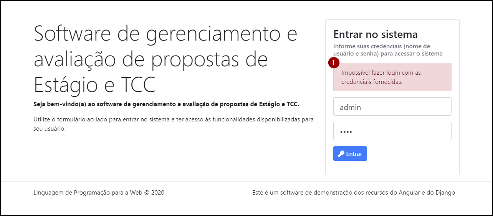

# Login

O componente login (`LoginComponent`) é responsável pela funcionalidade da tela de login (autenticação), cujo visual é ilustrado pela figura a seguir.

A figura apresenta: (1) uma identificação do sistema do lado esquerdo e, do lado direito, (2) um formulário para autenticação, que permite que o usuário informe dois campos: nome de usuário e senha. Quando os campos estão preenchidos o botão "Entrar" fica habilitado e pode ser tocado. Caso contrário, o botão permanece desabilitado.

Quando a tela é apresentada (o componente é iniciado) o componente verifica se há uma sessão ativa do usuário (utilizando o método `AuthService.user()`). Se houver uma sessão ativa, então apresenta a tela [Perfil](perfil.md).

Quando o usuário toca o botão "Entrar" o componente utiliza o método `AuthService.login()` e passa as informações fornecidas pelo usuário (nome de usuário e senha) como parâmetros. Se as credenciais estiverem corretas, o software armazena informações no `LocalStorage` para representar que o usuário iniciou uma sessão no software e apresenta a tela [Perfil](perfil.md). Caso contrário, apresenta a informação de que as credenciais estão incorretas, como ilustra a figura a seguir.

A figura ilustra (1) a mensagem que informa ao usuário de que não foi possível fazer login porque as credenciais estão incorretas.

## Estrutura do controller

### Atributos

| atributo   |     tipo      | descrição                                                    |
| :--------- | :-----------: | :----------------------------------------------------------- |
| `user`     |      any      | armazena informações do usuário da sessão, se disponível     |
| `error`    |      any      | armazena o erro de retorno do servidor, quando aplicável     |
| `username` |      any      | vinculado ao campo de formulário "username"                  |
| `password` |      any      | vinculado ao campo de formulário "password"                  |
| `auth$`    | `AuthService` | utilizado na injeção de dependência do serviço `AuthService` |
| `user$`    | `UserService` | utilizado na injeção de dependência do serviço `UserService` |
| `router`   |   `Router`    | utilizado na injeção de dependência do serviço `Router`      |

### Métodos

* `constructor`: injeta os serviços `AuthService`, `UserService`, `Router`
* `ngOnInit`: chamado na instanciação do componente, obtém a informação do usuário da sessão e, se estiver definido, redireciona para a tela [Perfil](perfil.md) utilizando o método `Router.navigate()`
* `login`: chamado no tratador do evento `submit` do formulário; chama o método `AuthService.login()` passando como parâmetro os valores de `username` e `password`; na callback, redireciona o usuário para a tela [Perfil](perfil.md) ou armazena a informação do erro de retorno do backend

## Estrutura do template

A estrutura do template é composta por duas colunas (`div.col` e `div.col-4`) em uma linha (`div.row`). A primeira coluna apresenta identificação do software e um texto de boas-vindas. A segunda coluna contém um card (`div.card`) e o formulário.

O formulário (`form`) está vinculado a uma variável de template `formLogin`, que é utilizada para controlar o valor do atributo `disabled` do botão "Entrar". Além disso, há o tratador do evento `submit`, que chama o método `login()`.

Dentro do formulário há três `div.form-group` contendo os campos do formulário e um botão:

1. contém o `input[text].form-control` vinculado ao atributo `username`; ele é marcado como campo requerido e são utilizados recursos de validação;
2. contém o `input[password].form-control` vinculado ao atributo `password`; ele também é marcado como requerido e são utilizados recursos de validação
3. contém o `button` cujo atributo `disabled` está vinculado à expressão `formLogin.invalid`, ou seja, o botão fica desabilitado se o formulário estiver inválido (no sentido da validação dos campos do formulário).
