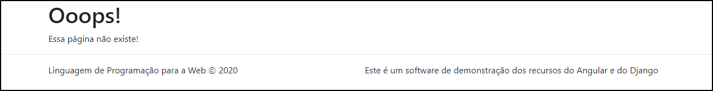

# Página não encontrada

O componente `PaginaNaoEncontradaComponent` representa a tela que é apresentada se o usuário tentar acessar um endereço que não corresponde a uma tela válida do software. A figura a seguir ilustra a tela.

A tela apresenta uma indicação de que não foi possível acessar o conteúdo solicitado (conforme a barra de endereços do browser) porque ele não existe.
