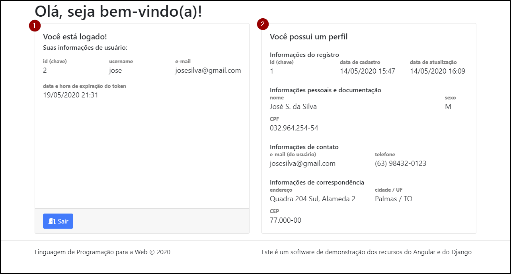
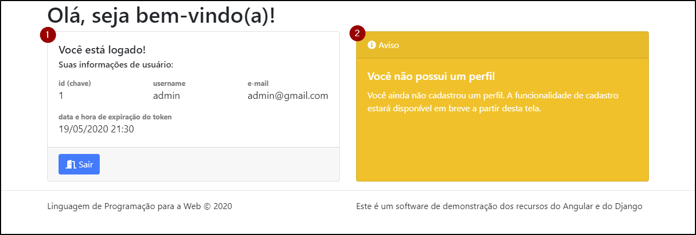

# Perfil

O componente `PerfilComponent` apresenta a tela de perfil do usuário, como ilustra a figura a seguir.

A figura demonstra que há dois paineis (cards) representando conteúdo da tela:

1. **painel de informações do usuário**: apresenta identificador, nome de usuário, e-mail e data e hora da expiração do token
2. **painel de informações do perfil**: apresenta identificador, data de cadastro, data de atualização, nome, sexo, CPF, e-mail, telefone, endereço, cidade, UF e CEP

Quando o componente é acessado seu controller verifica se o usuário está logado, utilizando o método `AuthService.user()`. Se estiver logado, então recupera as informações do perfil, utilizando o método `PerfilService.perfilLogado()`. Caso contrário redireciona para a tela [Login](login.md).

Se o usuário tocar o botão "Sair" o controller chama o método `AuthService.logout()`, que encerra a sessão do usuário (limpa os dados do `LocalStorage`) e redireciona o usuário para tela [Login](login.md).

Pode acontecer de o usuário não possuir um perfil, então a tela se comporta como ilustra a figura a seguir.

O painel de informações do usuário (1) continua sendo apresentado, mas, como o usuário não possui perfil, a tela apresenta uma mensagem de aviso (2), informando que o usuário ainda não tem perfil cadastrado.

## Estrutura do controller

### Atributos

| atributo  |     tipo      | descrição                                       |
| :-------- | :-----------: | :---------------------------------------------- |
| user      |      any      | armazena a informação do usuário da sessão      |
| perfil    |      any      | armazena o perfil do usuário, se disponível     |
| temPerfil |    boolean    | indica se o usuário tem perfil ou não           |
| `auth$`    | `AuthService` | utilizado na injeção de dependência do serviço `AuthService` |
| `perfil$`    | `PerfilService` | utilizado na injeção de dependência do serviço `PerfilService` |
| `router`   |   `Router`    | utilizado na injeção de dependência do serviço `Router`      |

### Métodos

* `constructor`: injeta os serviços `AuthService`, `PerfilService`, `Router`
* `ngOnInit`: chamado na instanciação do componente, obtém a informação do usuário da sessão e, se estiver definido, chama o método `PerfilService.login()` para obter o perfil do usuário; na callback, armazena o retorno do backend o  atributo `perfil` ou, se houver erro, indica que o usuário não tem perfil; caso contrário, se o usuário da sessão não estiver disponível (usuário não está logado) chama o método `Router.navigate()` para redirecionar o usuário para a tela [Login](login.md)
* `logout`: chamado no tratador do evento `click` botão "Sair"; chama o método `AuthService.logout()` e, na sequência, redireciona o usuário para a rota padrão

## Estrutura do template 

A estrutura do template é composta por dois card (div.card). No primeiro card, são apresentadas as informações do usuário (acessando os atributos: `id`, `username`, `email`, `token_expires`). Além disso, o primeiro card contém o `button` "Sair", cujo tratador do evento `click` chama o método `logout`.

O segundo card (div.card) é apresentado com base na existência de perfil do usuário. Se tiver perfil, são apresentadas as informações do perfil (acessando os atributos: `id`, `cadastrado_em`, `atualizado_em`, `nome`, `sexo`, `cpf`, `email`, `telefone`, `endereco`, `cidade`, `estado_uf`, `cep`). São utilizados diversos elementos `div.row` e `div.col` (e variações) fazendo uma composição que organiza as informações do perfil em linhas e colunas.

Se o usuário não tiver perfil, o card utiliza `bg-warning` para trocar a cor de fundo para destacar essa situação para o usuário e apresenta uma mensagem indicando que ele ainda não tem perfil cadastrado.
