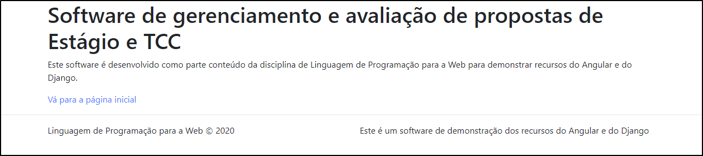

# Sobre

O componente `SobreComponent` apresenta a tela com informações do software, como ilustra a figura a seguir.

Por meio do link "Vá paga a página inicial" o usuário pode navegar para a tela inicial ([Login](login.md) ou [Perfil](perfil.md), conforme o caso).
